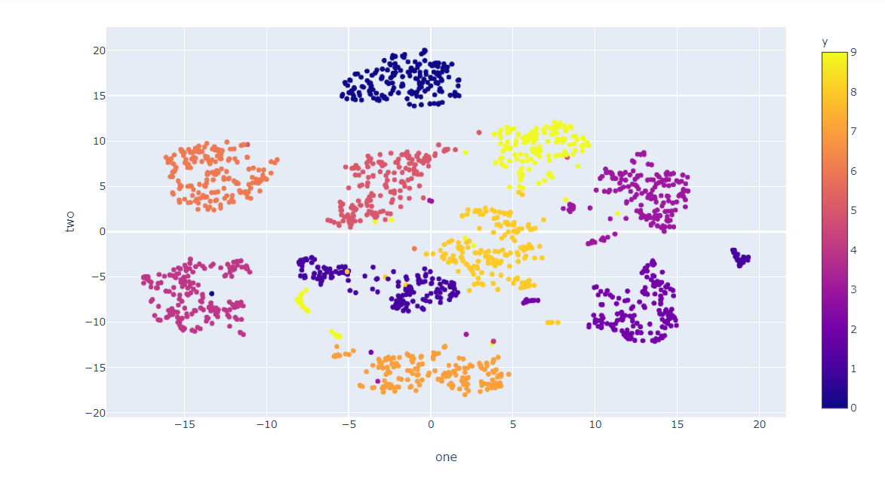
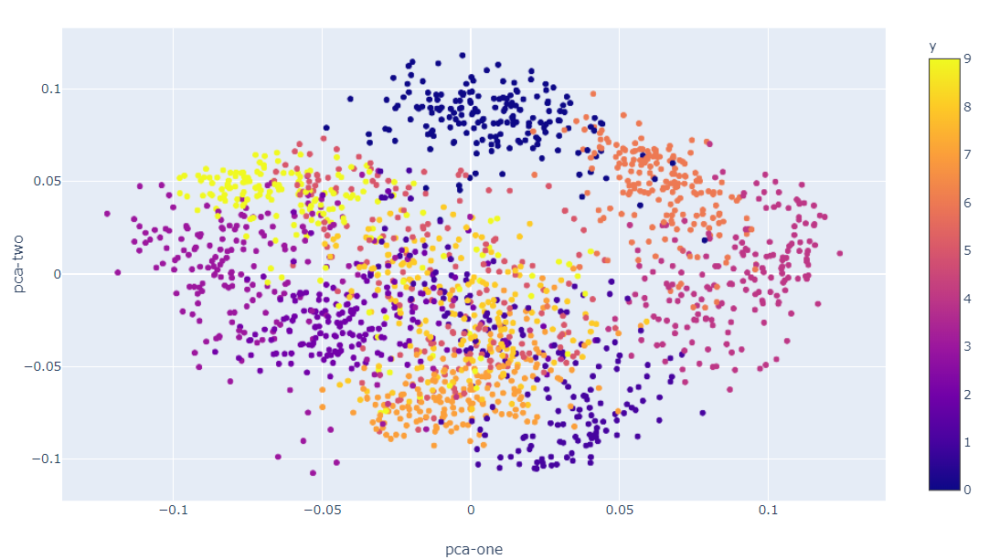
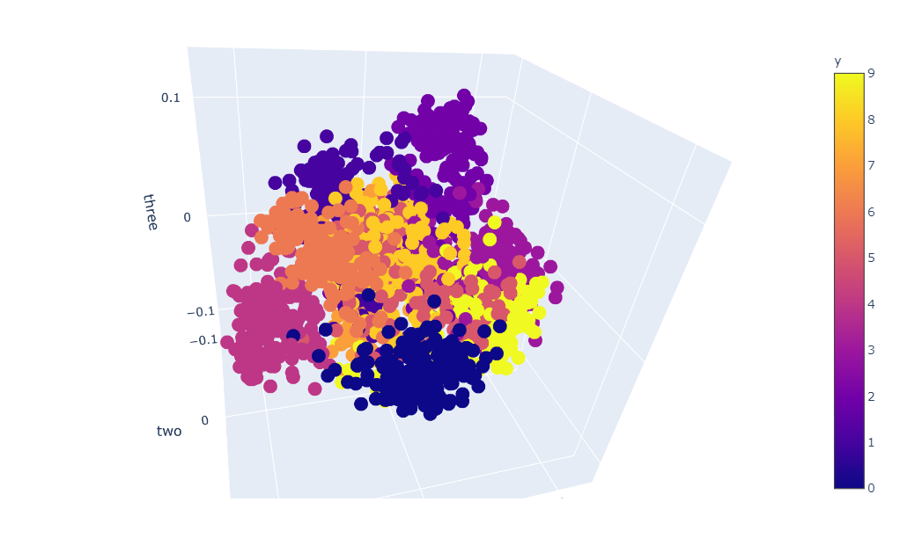
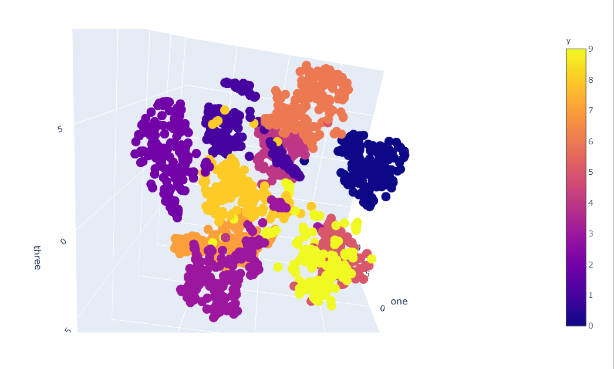

  
<div align="center">

 # CNN VISUALIZATION TOOL
 
 [](https://www.python.org/)
 
 <br>
 
</div> 


--------
>  One of the most debated topics in deep learning is how to interpret and understand a trained model – particularly in the context of high-risk industries like healthcare. The term “black box” has often been associated with deep learning algorithms. How can we trust the results of a model if we can’t explain how it works? Take the example of a deep learning model trained for detecting cancerous tumors. The model tells you that it is 99% sure that it has detected cancer – but it does not tell you why or how it made that decision. Did it find an important clue in the MRI scan? Or was it just a smudge on the scan that was incorrectly detected as a tumor? This is a matter of life and death for the patient and doctors cannot afford to be wrong. 

> As we have seen in the cancerous tumor example, it is crucial that we know what our model is doing – and how it’s making decisions on its predictions.
Typically, the reasons listed below are the most important points for a deep learning practitioner to remember:
- Understanding how the model works 
- Assistance in Hyperparameter tuning 
- Finding out the failures of the model and getting an intuition of why they fail 
- Explaining the decisions to a consumer / end-user or a business executive
> Neural nets are black boxes. In the recent years, several approaches for understanding and visualizing Convolutional Networks have been developed in literature. The purpose of the project is to design a Visualization Tool for Keras to visualize and debug what CNN’s are learning and to show heatmaps for a large variety of models like Resnet50, InceptionV3, Vgg16, MobileNet, etc.


-----------------------------------------------

## Screenshots

- 
- 
- 
- 
- 
- .png)
- .png)
- .png)
- .png)
- .png)
-----------------------------------------------
  
## Features

- [x] Visualization of deep learning models.
- [x] Visualization of high dimension images using dimensional reduction techniques such as t-SNE and PCA.
- [x] Comparative analysis of Image Net models.
-----------------------------------------------

## Future Enhancements
- [ ] Visualisation of filter maps of custom CNN.

-----------------------------------------------

## Installations
- Install Dependencies:
    
``` pip3 install -r requirements.txt ```
- Start Server:

``` python index.py ```

-----------------------------------------------

## Contributions

 We're are open to `enhancements` & `bug-fixes` :smile: 
 
-----------------------------------------------

## Note 

This project was done under `under 24-hours` from scratch with some basic preparation.

-----------------------------------------------

## Contributors

- [Arjun Mohnot](https://github.com/arjun009)
- [Kumar Utkarsh](https://github.com/amisha-w)
- [Vipul Gupta](https://github.com/vipul9810)
- [Gagan Talreja](https://github.com/gagantalreja)

-----------------------------------------------

This project was a part of LNMHacks'19.


 


